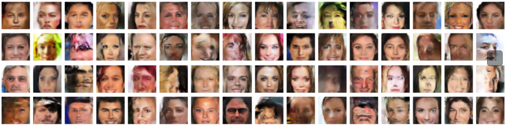
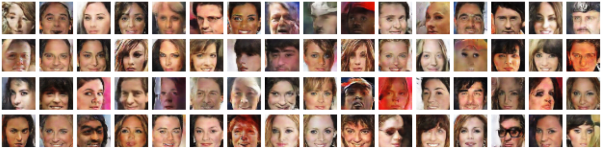
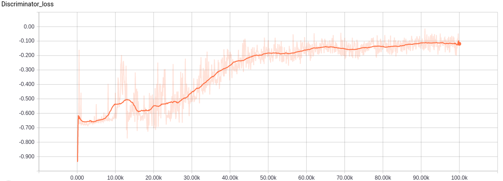
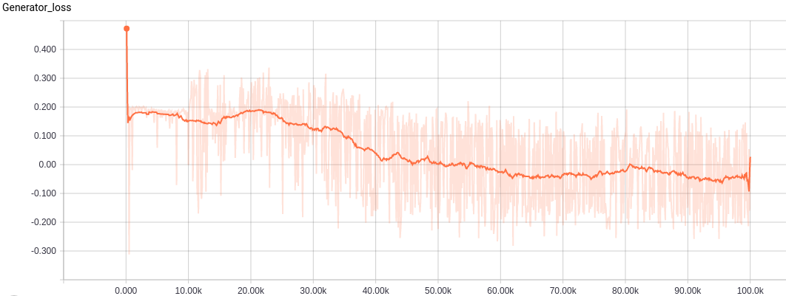
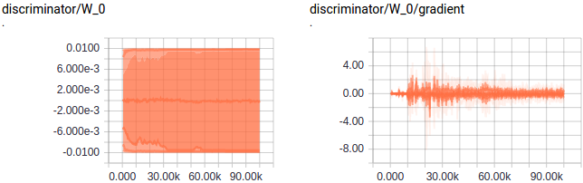

# WassersteinGAN.tensorflow
Tensorflow implementation of Arjovsky et al.'s [Wasserstein GAN](https://arxiv.org/abs/1701.07875)

1. [Prerequisites](#prerequisites)
2. [Results](#results)
3. [Observations](#observations)
4. [References and related links](#references-and-related-links)

Note: The paper refers to discriminators as critic. I use these names interchangably in my thoughts below.

A pretty interesting paper that takes on the problem of stability in GANs and interpretability of the loss function during training. GANs essentially are models that try to learn the distribution of real data by minimizing f-divergence (difference in probabilty distribution) by generating adversarial data. The convergence in min max objective of the originally proposed GAN can be interpreted as minimizing the Jensen Shannon (JS) divergence. In this paper, the authors point out the shortcomings in such metrics when the support of the two distributions being compared do not overlap and propose using the earth movers/wasserstein distance as an alternative to JS. The parallel lines example provides a nice intuition to the differences in the f-divergence metrices. Note that when the f-divergence is discrete as in JS, KL we might face problems in learning models with gradients as the divergence loss is not differetiable everywhere.

Theorem 1 proposed in the paper is probably the key takeaway for anyone wondering why wasserstein distance might help in training GANS. The theorem basically states that a distribution mapping function (critic) that is continuous with respect to its parameters and locally lipschitz has a continuous and almost everywhere differentiable wasserstein distance.

A continuos and almost everywhere differentiable metric would mean we can strongly train the discriminator before doing an update to the generator which in turn would receive improved reliable gradients to train from the discriminator. With the earlier formulations of GAN such training was not possible since training discriminator strongly would lead to vanishing gradients.

Given that neural networks are generally continuous w.r.t to its parameters, the thing to make sure is the critic being Lipschitz. By clipping the weight parameters in the critic, we prevent the model from saturating while the growth is made atmost linear. This would mean the gradients of the function is bounded by the slope of this linearity becoming Lipschitz bound.

## Prerequisites
- Code was tested in Linux system with Titan GPU. 
- Model was trained with tensorflow v0.11 and python2.7. Newer versions of tensorflow requires updating the summary statements to avoid depreceated warnings.
- CelebA dataset should be downloaded and unzipped manually. [Download link](https://www.dropbox.com/sh/8oqt9vytwxb3s4r/AADIKlz8PR9zr6Y20qbkunrba/Img/img_align_celeba.zip)
- Default arguments to **main.py** runs GAN with cross entropy objective.
- **run_main.sh** has command to run Wasserstein GAN model.

## Results
- The network architecture used to train the model is very similar to that used in the original DCGAN. This is different from what is implemented in the pytorch version of the code released with the paper - Both the generator and discriminator have "extra layers" of stride one.

- All bias terms in the network are removed. I'm not quite sure what the justification for dropping the bias in generator but with the critic it might have to do with constraing the function to a smaller lipschitz bound.

- The results below are after 1e5 iterations which took approximately 18hrs in my system. This is probably not the most converged result so consider it with a pinch of salt.

  Random sample of images generated after training GAN with wasserstein distance for 1e5 itrs, lr=5e-5, RMSPropOptimizer.

  For comparison: Random sample of images generated using GAN with cross entropy objective for 2e4 itrs, lr=2e-4, AdamOptimizer.

## Observations
- After spending quite a while to get the theory in the paper, I was suprised and pleased at how simple the implementation was.
  Major changes from the point of implementations are
  - The discriminator/critic no longer produces sigmoid or probabilistic output. The loss in discriminator is simple the difference in output between real and generated images.
  - Train critic multiple times for each generator update. 
  - The weights in the critic is clamped to small values around zero.
  - Requires low learning rate and optimizers that do not use momentum.
- Training is very slow. This should be expected, given the very low learning rate and multiple updates to discriminator for each generator update.

- Discriminator loss for Wasserstein GAN. Note that the original paper plots the discriminator loss with a negative sign, hence the flip in the direction of the plot. From what I noticed, the general trend of the discriminator is converging but it does increase at times before dropping back. 

- Training to minimize wasserstein distance in this problem space can be interpreted as making the critic assign low values to real data and high values to fake data. The generator on the other hand is trying to generate images that has the critic giving it low values like the ones the real images get. In other words, the model converges when the critic is no longer able to differentiate and assign different values to generated and real images - a reason why I think calling the critic a discriminator is still a reasonable thing :smile:

- The generator as mentioned above is trying the have the critic assign low values like the ones real images get. While training the generator oscillates quite a bit around zero.

- Weights are clipped in critic to maintain lipschitz bound and continuity. An observation here as pointed out by the author in reddit worth highlighting
> The weight clipping parameter is not massively important in practice, but more investigation is required. Here are the effects of having larger clipping parameter c:

 > The discriminator takes longer to train, since it has to saturate some weights at a larger value. This means that you can be a risk of having an insufficiently trained critic, which can provide bad estimates and gradients. Sometimes sign changes are required in the critic, and going from c to -c on some weights will take longer. If the generator is updated in the middle of this process the gradient can be pretty bad.

 > The capacity is increased, which helps the optimaly trained disc provide better gradients.

 > In general it seems that lower clipping is more stable, but higher clipping gives a better model if the critic is well trained.

- Theoretically, the claims in the paper about quality corresponding to loss is understandable given the formulation but since quality is a relative term, I missed to see improvements in my generated images with loss for all generated images i.e how much of a loss improvement corresponds to image quality improvement is unclear. Having said that, it is pretty possible that all images generated after "convergence" are realistic. 

- How this new loss term would correspond to previous works associated with GANs namely semi/unsupervised learning, adaptation, adversarial losses in computer vision tasks and such is pretty exciting and interesting.

## References and related links
- Pytorch implementation of WasserstienGAN by authors of the paper - [link](https://github.com/martinarjovsky/WassersteinGAN)
- Interesting discussion on r/machinelearning - [link](https://www.reddit.com/r/MachineLearning/comments/5qxoaz/r_170107875_wasserstein_gan/)
